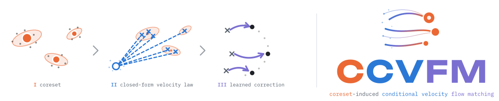
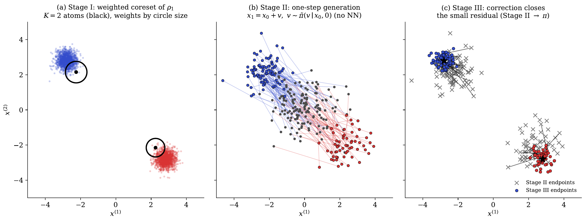
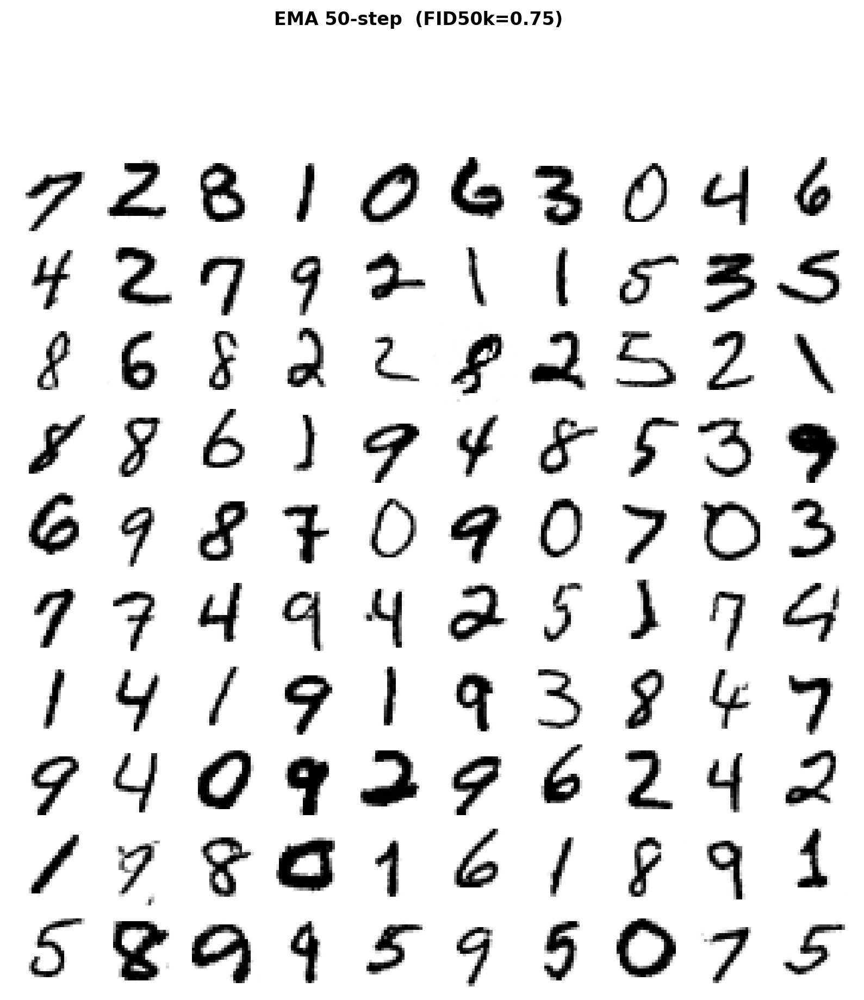
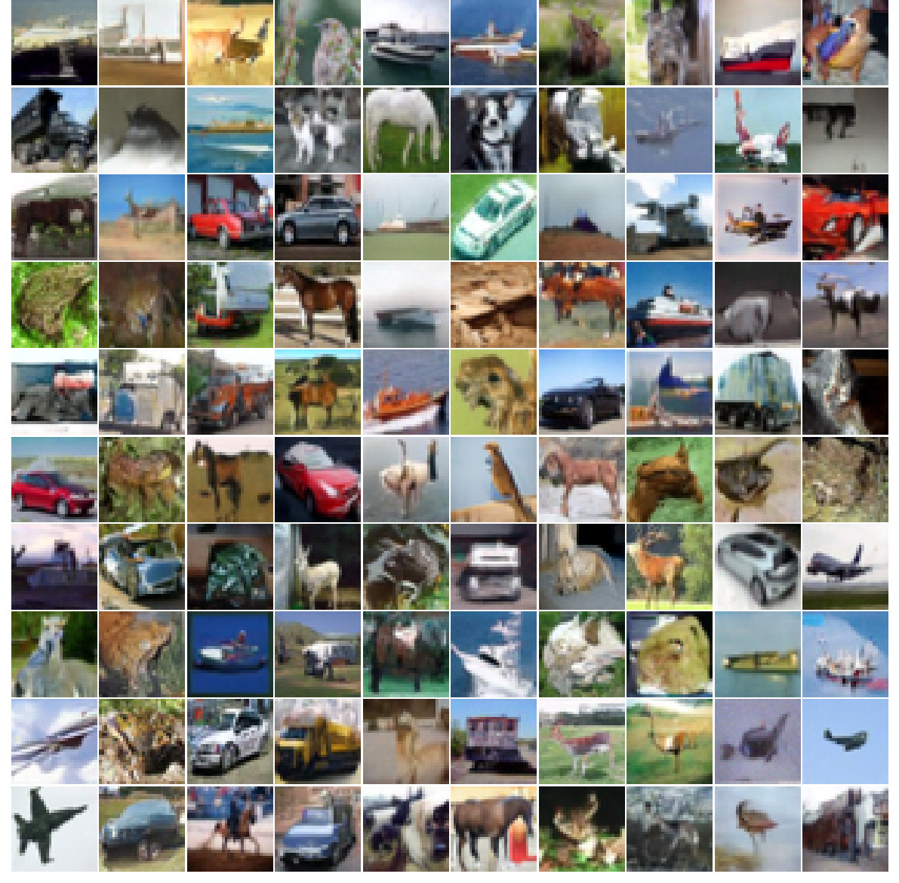
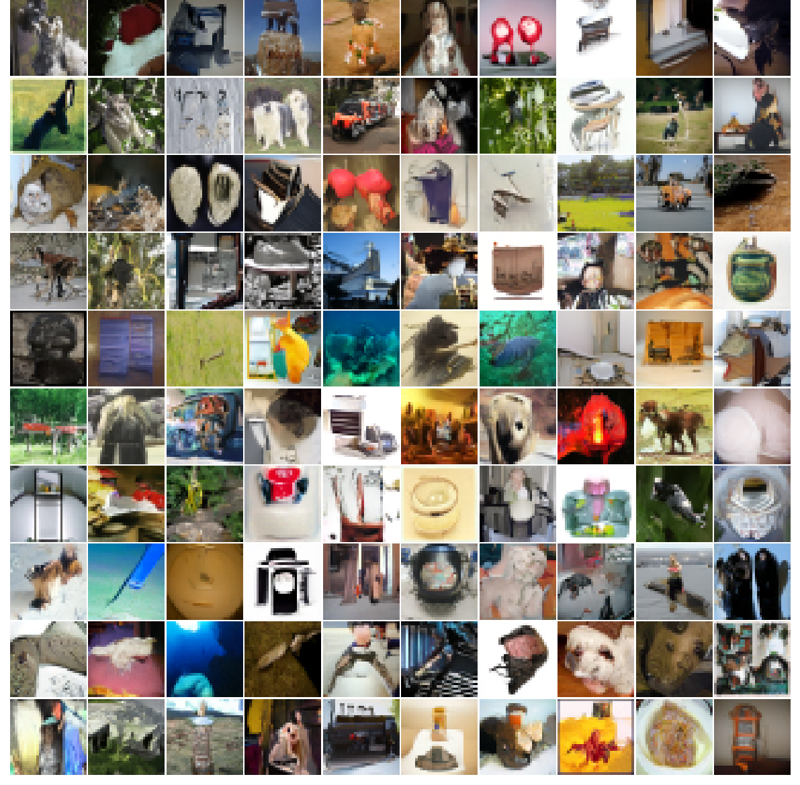
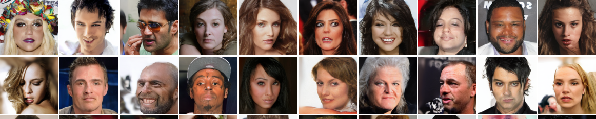
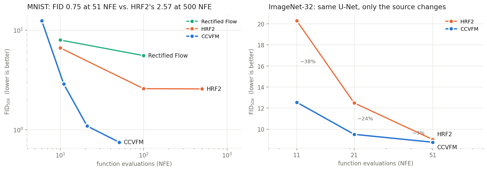
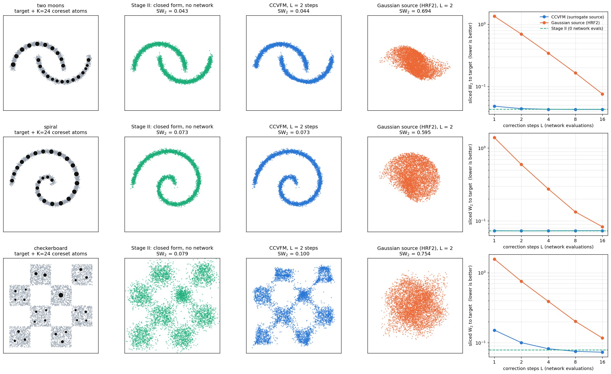
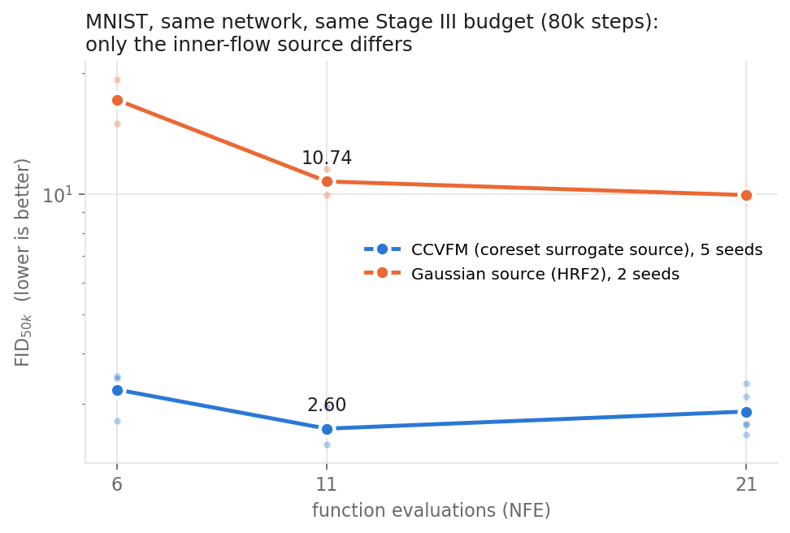

<div align="center">

<picture>
  <source media="(prefers-color-scheme: dark)" srcset="assets/logo_dark.svg">
  
</picture>

# Coreset-Induced Conditional Velocity Flow Matching

**Hierarchical flow matching usually starts its inner flow from pure noise. CCVFM starts it from a closed-form coreset of the data, so the network only has to learn a small correction.**

[](https://ziwaa-se.github.io/CCVFM/)
[](https://arxiv.org/abs/2605.12951)
[](https://arxiv.org/abs/2605.12951)
[](LICENSE)


[Zihua She](mailto:she8@purdue.edu) · [Jianxi Su](mailto:jianxi@purdue.edu) · [Xiao Wang](mailto:wangxiao@purdue.edu)
<br>Department of Statistics, Purdue University

</div>

<p align="center"></p>
<p align="center"><sub><b>CCVFM in one picture.</b> (a) Stage I compresses the data into weighted coreset atoms. (b) Stage II samples the induced velocity law in closed form, with no network. (c) Stage III learns only the small remaining correction.</sub></p>

## Highlights

- **3× lower FID with 10× fewer steps than HRF2 on MNIST.** CCVFM reaches FID<sub>50k</sub> **0.75 at 51 NFE**. The best HRF2 result is 2.57 at 500 NFE.
- **Same network, better source.** On ImageNet-32 we keep HRF2's U-Net and FID protocol and change only the source distribution. FID drops by **38% at 11 NFE** and **24% at 21 NFE**.
- **The source is what matters.** In a controlled MNIST ablation (same network, same 80k-step budget), only the inner-flow source changes. The coreset surrogate reaches FID<sub>50k</sub> **2.60 ± 0.21** at 11 NFE; the Gaussian source reaches **10.74**.
- **Stage I is cheap.** The coreset surrogate of CIFAR-10 (K = 10,000) takes **95 s on one GPU**, and ImageNet-32 (1.28M images) takes **6 min**. That is under 0.5% of the training budget.
- **Stage II needs no network.** Sampling from the surrogate is a categorical draw plus a Gaussian draw, in closed form.
- **It comes with theory.** The source-to-target transport cost CCVFM's network must learn shrinks as $O(K^{-1/d})$. With a Gaussian source this cost stays bounded below by a constant, however large K or n is.
- **The results reproduce.** Five sampling seeds give MNIST FID<sub>50k</sub> **0.772 ± 0.011**. Retraining from scratch with a new seed gives **0.747**.

<table>
<tr>
<td align="center" width="25%"><br><b>MNIST</b><br>FID<sub>50k</sub> <b>0.75</b></td>
<td align="center" width="25%"><br><b>CIFAR-10</b><br>FID<sub>50k</sub> <b>6.35</b></td>
<td align="center" width="25%"><br><b>ImageNet-32</b><br>FID<sub>50k</sub> <b>8.76</b></td>
<td align="center" width="25%"><br><b>CelebA-HQ 256</b><br>FID<sub>28k</sub> <b>4.17</b></td>
</tr>
</table>
<p align="center"><sub>Uncurated samples; the same pools were used to compute the reported FIDs.</sub></p>

<p align="center"></p>

---

## How it works

A flow-matching model regresses the velocity $V = X_1 - X_0$ of the straight path $X_t=(1-t)X_0+tX_1$. The squared loss keeps only the conditional mean $\mathbb E[V\mid X_t]$. Hierarchical rectified flow (HRF2) instead learns the full conditional law $\pi(v\mid x_t,t)$ with a second flow in velocity space, but that inner flow starts from $\mathcal N(0,I)$ and must learn the whole noise-to-data transport. CCVFM keeps the hierarchy and replaces the inner source.

| | What happens | Learned parameters |
|---|---|---|
| **Stage I: coreset** | An entropic-Sinkhorn coreset compresses the data into $K$ weighted atoms. Each atom is lifted to a Gaussian by closed-form probabilistic PCA, giving the surrogate $\tilde\rho_1=\sum_k w_k\,\mathcal N(\mu_k, L_kL_k^\top+\sigma^2 I)$. | none (closed form, seconds to minutes) |
| **Stage II: closed-form velocity law** | Plugging $\tilde\rho_1$ into $\pi(v\mid x_t,t)\propto\rho_0(x_t-tv)\,\rho_1(x_t+(1-t)v)$ gives an explicit $K$-component Gaussian mixture $\tilde\pi(v\mid x_t,t)$. At $t=0$ it is simply $\tilde\rho_1(x_0+v)$. | none (one categorical draw plus one Gaussian draw) |
| **Stage III: correction flow** | A network $f_\theta(v,\tau,x_t,t)$ is trained by flow matching in velocity space. The source is $V_0\sim\tilde\pi(\cdot\mid x_t,t)$, drawn from the component that owns each data point (data-anchored coupling), and the target is $V_1=X_1-X_0$. The network therefore learns a small surrogate-to-target residual. | the correction network |

**Sampling ($J=1$, the recommended setting).** Draw $x_0\sim\mathcal N(0,I)$ and $v\sim\tilde\pi(\cdot\mid x_0,0)$. Then take $L$ Euler steps $v\leftarrow v+\tfrac1L f_\theta(v,\ell/L,x_0,0)$ and return $x_0+v$. The total cost is NFE $=L+1$, counting the closed-form draw as one.

<details>
<summary><b>Theory in two statements</b> (see the paper for the precise assumptions)</summary>

Define the correction task at the generation boundary as $D(Q)=\big(\mathbb E_{X_0}W_2^2(Q(\cdot\mid X_0,0),\,\pi(\cdot\mid X_0,0))\big)^{1/2}$.

1. **Transport-task reduction.** $D(Q_{\mathrm{CCVFM}})=W_2(\rho_1,\tilde\rho_1)\le C_Q K^{-1/d}$ under the Stage-I compression assumption. For the Gaussian source, $D(Q_{\mathrm{HRF2}})\ge\sqrt d\,(\sqrt{\sigma_1^2+1}-1)$, a positive constant in $K$ and $n$. The Euler budget needed to reach a given accuracy scales with $D(Q)^2$.
2. **Training-target scale.** With the surrogate source, the conditional second moment of the regression target $V_1-V_0$ depends on within-mode quantities only. With an independent Gaussian source it pays the cross-mode diameter plus $d$. The data-anchored coupling keeps the source marginal exactly $\tilde\pi(\cdot\mid C)$, so training and inference use the same source.

</details>

---

## Quickstart

```bash
git clone https://github.com/ziwaa-se/CCVFM.git && cd CCVFM
pip install -e .            # installs the small `ccvfm` package (torch, numpy, scipy, matplotlib)
python -m pytest -q tests   # checks the closed forms against dense / Monte-Carlo references
```

### CCVFM in 15 lines

```python
import torch
from ccvfm import fit_coreset_gmm, ccvfm_loss, sample, MLPCorrection

x = ...                                        # (n, d) training data

gmm = fit_coreset_gmm(x, K=64, rank=1)         # Stage I: Sinkhorn coreset + low-rank GMM
x_fast = sample(None, gmm, 10_000)             # Stage II: closed form, zero network evaluations

net = MLPCorrection(dim=x.shape[1])            # Stage III: learn only the residual
opt = torch.optim.Adam(net.parameters(), lr=1e-3)
for step in range(5000):
    loss = ccvfm_loss(net, gmm, x[torch.randint(len(x), (512,))])
    opt.zero_grad(); loss.backward(); opt.step()

x_gen = sample(net, gmm, 10_000, L=4)          # 4 network evaluations
```

`ccvfm_loss(..., source="gaussian")` trains the HRF2 baseline with the same network, which makes controlled comparisons one argument away. The package is dimension-agnostic, and the low-rank covariance keeps every operation $O(Kdr)$.

### Two runnable examples

| Example | What you get | Cost |
|---|---|---|
| [`examples/toy2d.py`](examples/toy2d.py) | Stage I → II → III on three 2D targets, compared against a Gaussian-source (HRF2) network with the same budget | a few minutes, CPU is fine |
| [`examples/mnist_quickstart.py`](examples/mnist_quickstart.py) | full pipeline on MNIST (K = 1000, r = 30, 80k steps) with sample grids and FID<sub>50k</sub>; our run gives **2.40 at 11 NFE** | ~40 min on one GPU |

<p align="center"></p>
<p align="center"><sub>Output of <code>examples/toy2d.py</code>. With 1–2 network evaluations, CCVFM is 7–28× closer to the target (sliced W<sub>2</sub>) than the same network trained from a Gaussian source. In 2D the closed-form Stage II draw alone is already close to the target.</sub></p>

---

## Results

All FIDs use InceptionV3 pool features. FID<sub>50k</sub> compares 50k samples against the 50k training images (the HRF2 protocol). NFE counts correction-network evaluations plus one for the closed-form Stage II draw. Raw CSVs are in [`results/`](results/).

<table>
<tr><td valign="top">

**MNIST** (K = 2000, r = 50)

| Method | NFE | FID<sub>50k</sub> |
|---|---:|---:|
| Rectified Flow | 100 | 5.56 |
| HRF2 | 100 | 2.59 |
| HRF2 | 500 | 2.57 |
| **CCVFM** | 11 | 2.88 |
| **CCVFM** | 21 | **1.09** |
| **CCVFM** | 51 | **0.75** |

</td><td valign="top">

**ImageNet-32** (K = 5000, r = 80)

| Method | NFE | FID<sub>50k</sub> |
|---|---:|---:|
| HRF2 | 11 | 20.29 |
| **CCVFM** | 11 | **12.55** |
| HRF2 | 21 | 12.49 |
| **CCVFM** | 21 | **9.51** |
| HRF2 | 51 | 9.02 |
| **CCVFM** | 51 | **8.76** |

</td></tr>
<tr><td valign="top">

**CIFAR-10** (K = 10000, r = 80)

| Method | NFE | FID<sub>50k</sub> |
|---|---:|---:|
| DDPM | 1000 | 3.17 |
| Flow Matching | adaptive | 6.35 |
| Consistency Model | 1 | 8.70 |
| **CCVFM** | 11 | 9.66 |
| **CCVFM** | 21 | 7.24 |
| **CCVFM** | 51 | **6.35** |

</td><td valign="top">

**CelebA-HQ 256** (DC-AE latent, K = 10000, r = 128)

| Method | NFE | FID<sub>28k</sub> |
|---|---:|---:|
| DDPM | 1000 | 7.03 |
| ADM | 1000 | 5.11 |
| LDM-4 | 200 | 5.11 |
| **CCVFM-B** (DiT-B) | 51 | 5.59 |
| **CCVFM-L** (DiT-L) | 51 | **4.17** |

</td></tr>
</table>

<sub>Baselines are quoted from their papers (MNIST and ImageNet-32 HRF2/RF rows from HRF2, Table 7). The CIFAR-10 and CelebA baselines are shown for context and differ in protocol or architecture. See the paper for the complete tables.</sub>

### What the surrogate source buys

<p align="center"></p>

To isolate the contribution of the source, we train the same correction U-Net on MNIST with the same budget (80k steps, surrogate K = 1000, r = 30). The only change is where the inner flow starts: the coreset surrogate (CCVFM) or $\mathcal N(0,I)$ (HRF2). Everything else is identical.

| Source of the inner flow | FID<sub>50k</sub> @ 6 NFE | @ 11 NFE | @ 21 NFE |
|---|---:|---:|---:|
| Gaussian $\mathcal N(0,I)$ (HRF2), 2 seeds | 17.17 | 10.74 | 9.94 |
| **Coreset surrogate (CCVFM)**, 5 seeds | **3.25 ± 0.32** | **2.60 ± 0.21** | **2.86 ± 0.36** |

The measured size of the regression target explains the gap. At t = 0, $\mathbb E\|V_1-V_0\|^2$ is **1655** with the Gaussian source and **36** with CCVFM on MNIST (45× smaller). On CIFAR-10 it is **6929** vs **468** (15× smaller). The Gaussian-source value matches its closed form $\mathbb E\|V_1\|^2+d$ to within 0.03%. Raw numbers: [`results/mnist_source_ablation.csv`](results/mnist_source_ablation.csv), [`results/training_target_second_moment.csv`](results/training_target_second_moment.csv).

**Reproducibility.** On the MNIST headline checkpoint, 5 sampling seeds give FID<sub>50k</sub> 2.958 ± 0.032 / 1.136 ± 0.017 / **0.772 ± 0.011** at 11 / 21 / 51 NFE. A full re-training with a different Stage III seed gives 2.994 / 1.125 / **0.747**. The seed-to-seed spread is one to two orders of magnitude smaller than the gap to HRF2.

**Stage I cost** (one GPU, excluding data loading): MNIST (n = 60k, K = 2000) 10 s; CIFAR-10 (n = 50k, K = 10,000) 95 s; ImageNet-32 (n = 1.28M, K = 5000) 350 s.

---

## Reproducing the paper

The exact scripts behind every number live in [`experiments/`](experiments/). [`experiments/README.md`](experiments/README.md) lists the commands, the expected output files and the provenance of each headline number. SLURM templates are in [`slurm/`](slurm/). Each run below fits on one 80 to 96 GB GPU.

| Dataset | Command (from `experiments/`) | GPU time | Expected |
|---|---|---|---|
| MNIST | `python prepare_mnist.py && python mnist_pixel_ccvfm.py` | ~1 h | FID<sub>50k</sub> 0.75 @ 51 NFE |
| CIFAR-10 | `cifar10_pixel_hrf2_ccvfm.py` (400k steps), then `resume_cifar10_pixel_hrf2_ccvfm.py` (to 720k) | ~24 h + ~20 h | FID<sub>50k</sub> 6.35 @ 51 NFE |
| ImageNet-32 | `imagenet32_pixel_hrf2_ccvfm.py` | ~25 h | FID<sub>50k</sub> 8.76 @ 51 NFE |
| CelebA-HQ 256 | `celebahq_dcae_dit_cfg.py` (continue with `resume_celebahq_dcae_dit_cfg.py` if your wall-clock limit is < 52 h), then `eval_celebahq_dcae_dit_cfg.py` | ~52 h + ~4 h | FID 4.17 @ 51 NFE (w = 0) |

Every script accepts `--smoke` for a few-minute end-to-end check. Datasets (torchvision MNIST/CIFAR-10, Hugging Face ImageNet-32 and CelebA-HQ) and the DC-AE autoencoder download automatically on first use.

## Repository layout

```
ccvfm/          small, documented, dimension-agnostic implementation (the thing to import)
  coreset.py      Stage I   Sinkhorn coreset + closed-form PPCA lift
  gmm.py          low-rank GMM with Woodbury densities / sampling
  velocity.py     Stage II  closed-form conditional velocity law, data-anchored coupling
  flow.py         Stage III loss + nested J x L sampler
  nets.py         reference MLP / U-Net correction networks, EMA
  metrics.py      sliced W2, Inception FID
examples/       toy2d.py, mnist_quickstart.py
experiments/    the paper scripts (MNIST, CIFAR-10, ImageNet-32, CelebA-HQ) + evaluation
slurm/          job templates for the experiments
results/        CSVs behind every reported number
tests/          correctness tests for ccvfm/
tools/          figure generation for this README
docs/           project homepage (GitHub Pages)
```

## Citation

```bibtex
@inproceedings{she2026ccvfm,
  title     = {Coreset-Induced Conditional Velocity Flow Matching},
  author    = {She, Zihua and Su, Jianxi and Wang, Xiao},
  booktitle = {Advances in Neural Information Processing Systems (NeurIPS)},
  year      = {2026},
  note      = {arXiv:2605.12951}
}
```

## Acknowledgements

The dual-branch U-Net in `experiments/hrf_models/` is taken from Hierarchical Rectified Flow (Zhang, Yan, Schwing & Zhao, ICLR 2025) and is itself built on OpenAI's [guided-diffusion](https://github.com/openai/guided-diffusion) (MIT). The CelebA-HQ experiments use the [DC-AE](https://github.com/mit-han-lab/efficientvit) autoencoder through `diffusers`. See [THIRD_PARTY_NOTICES.md](THIRD_PARTY_NOTICES.md).

## License

MIT. See [LICENSE](LICENSE).
